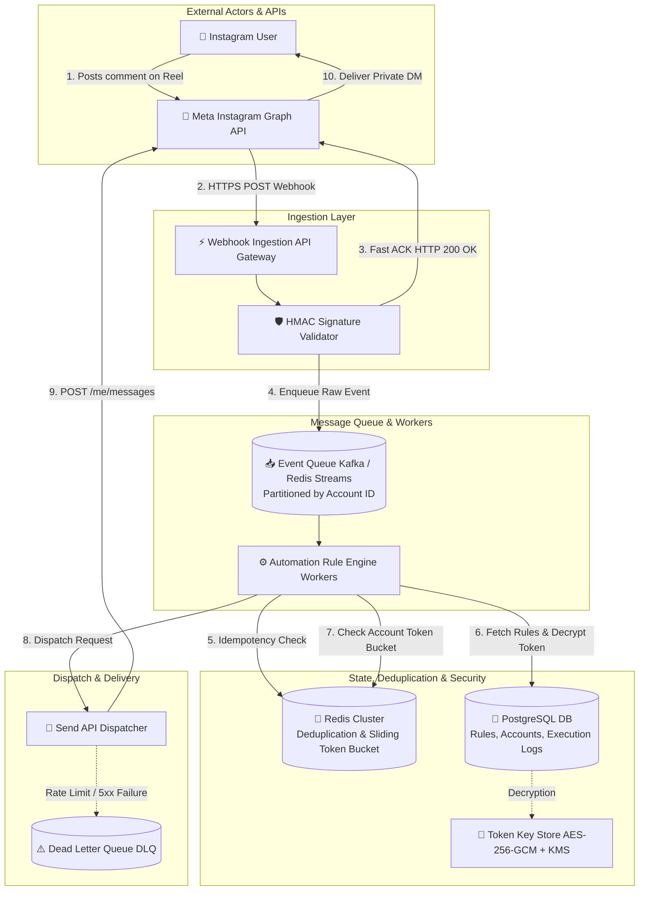
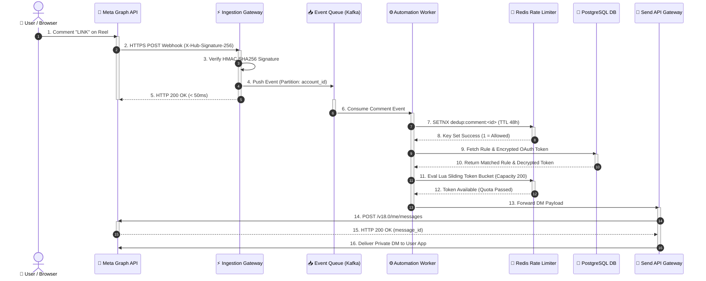
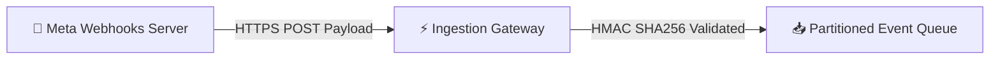
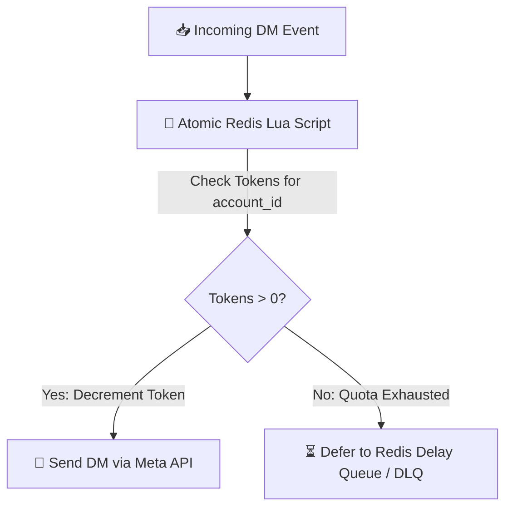
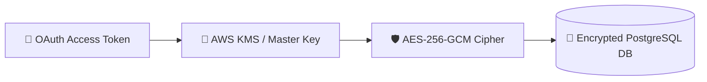
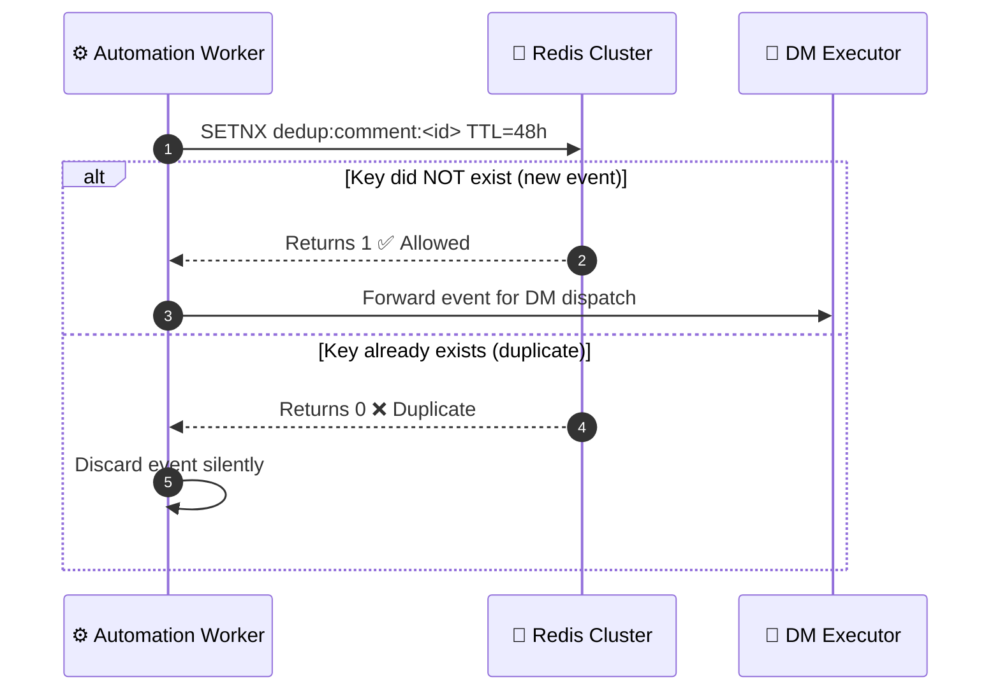
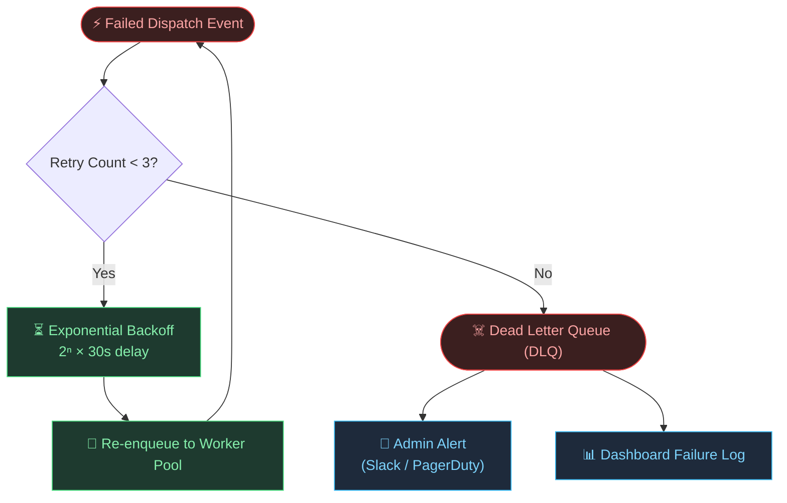

Instagram creators and businesses frequently lose high-intent customer leads because they cannot manually respond to hundreds of post comments (such as *"PRICE?"*, *"LINK?"*, or *"SEND INFO"*) at scale. Manually replying to every comment via Direct Message (DM) is unscalable, and publicly pasting link URLs clutters comment threads and exposes sales funnels to competitors.

To solve this, modern SaaS platforms like **ManyChat** or **SuperProfile** provide **Comment-to-DM Automation**. When a user posts a comment containing a trigger keyword on a Creator's post, reel, or live stream, the backend system automatically sends a personalized private DM to the commenter, posts an optional public reply, and routes the user into an automated conversion funnel.

In this deep dive, we walk through the end-to-end **Backend Systems Architecture** required to build a resilient, multi-tenant Instagram DM automation platform from scratch using Meta's official Instagram Graph API.

---

## 1. Core Requirements & Engineering Constraints

Designing an Instagram automation engine requires balancing high throughput with strict third-party compliance.

### Functional Requirements
1. **Webhook Ingestion**: Receive and process real-time Meta webhooks for comments posted on connected Instagram Creator accounts.
2. **Keyword Engine**: Match incoming comment text against user-configured trigger rules (exact match, contains phrase, regex patterns).
3. **Automated DM Dispatch**: Send structured private messages (text, buttons, quick replies) via the Meta Send API.
4. **Public Comment Replies**: Optionally post a randomized public reply on the comment thread (e.g., *"Check your DM! 📩"*).
5. **Multi-Tenant OAuth**: Manage long-lived Instagram Graph API access tokens across thousands of creator accounts securely.

### Non-Functional Requirements & Constraints
- **Sub-Second Latency**: Deliver private DMs within **< 2 seconds** of comment creation.
- **High Throughput**: Ingest and process **10,000+ comment events per second** during viral product drops or reel surges.
- **Strict Rate Limit Compliance**: Meta enforces per-account rate limits (e.g., maximum ~250 DMs per hour per account). Exceeding these limits risks temporary or permanent API bans.
- **Idempotency & Deduplication**: Guarantee that a commenter receives **exactly one** automated DM per trigger comment, even if Meta sends duplicate webhook payloads.
- **24-Hour Messaging Window**: Enforce Meta's 24-hour policy restriction for customer-initiated conversations.

---

## 2. High-Level Architecture Overview

The system uses an **event-driven, decoupled microservices architecture** where lightweight ingestion nodes acknowledge webhooks immediately, delegating matching, rate-limiting, and dispatching to background worker pools.



### End-to-End Execution Sequence Flow

The interactive sequence diagram below highlights the precise chronological lifecycle and activation boundaries across components:



---

## 3. Deep-Dive Architectural Decisions: Trade-off Analysis

Building a resilient automation engine requires key technical choices. Below is the detailed breakdown of each major architectural decision, why it was chosen, and its **pros and cons**.

---

### Architectural Decision 1: Push-Based Webhook Ingestion vs. Pull-Based Polling

To detect new comments on Instagram posts, we evaluated **Real-time Webhook Ingestion** vs. **Periodic API Polling**.



#### Trade-off Matrix

| Criterion | Push-Based Webhook Ingestion (Chosen) | Pull-Based API Polling |
| :--- | :--- | :--- |
| **Latency** | **< 100ms** (Instant trigger on event) | **10s – 5 mins** (Subject to poll interval) |
| **API Quota Efficiency** | **High**: Zero requests consumed while idle | **Low**: Thousands of wasted GET requests |
| **Scale During Traffic Spikes** | Scales naturally with incoming HTTP POST traffic | Causes API rate limit exhaustion during polls |
| **Complexity** | Requires public endpoint, HMAC validation & queueing | Simple script, but fails at multi-tenant scale |

**Decision**: **Push-Based Webhook Ingestion**. Meta sends real-time webhooks for `comments` objects. The ingestion gateway verifies the request signature, pushes the raw payload to a distributed queue, and immediately returns HTTP 200 OK.

---

### Architectural Decision 2: Message Queue Selection — Apache Kafka vs. Redis Streams vs. RabbitMQ

Incoming comment events must be decoupled from execution workers to handle viral traffic spikes without dropping events or crashing database nodes.

#### Trade-off Matrix

| Feature | Apache Kafka (Chosen for Enterprise) | Redis Streams (Chosen for MVP) | RabbitMQ |
| :--- | :--- | :--- | :--- |
| **Partitioning Key** | Native partitioning by `account_id` | Streams with Consumer Groups | Exchange routing keys |
| **Strict Ordering** | Guaranteed within partition | Guaranteed per stream key | No strict FIFO under concurrent consumers |
| **Replayability** | Retains logs up to $N$ days for backfills | In-memory log truncation required | Messages deleted upon ACK |
| **Operational Overhead** | High (Cluster management / ZooKeeper or KRaft) | Extremely Low (Uses existing Redis cluster) | Medium (Erlang cluster management) |

**Decision**: **Partitioned Message Queue (Redis Streams for MVP / Apache Kafka for high-scale)**. 
Events are partitioned by `instagram_account_id`. Partitioning guarantees that all comments targeting the *same* creator account are processed sequentially by the same worker instance, eliminating race conditions during rate-limiting calculations.

---

### Architectural Decision 3: Per-Account Rate Limiting — Sliding Window Token Bucket via Redis

Meta imposes strict rate limits on the Instagram Messaging API (~250 messages/hour per connected page). Exceeding this rate results in Meta returning `HTTP 400 (Error Code 32 / Rate Limit Exceeded)`.



#### Token Bucket Implementation Algorithm

We implement a **Sliding Window Token Bucket** rate-limiter using an atomic Redis Lua Script:

1. **Bucket Capacity**: Max 200 tokens (leaving a 50-token buffer below Meta's 250 limit).
2. **Refill Rate**: 1 token restored every 14.4 seconds ($3600 \text{ seconds} / 250 \text{ DMs}$).
3. **Atomic Lua Execution**: Checks current token balance and decrements atomically to prevent concurrency bugs across distributed workers.

#### Trade-off Matrix

| Strategy | Pros | Cons |
| :--- | :--- | :--- |
| **Fixed Window Counter** | Simple to implement in Redis (`INCR`) | Vulnerable to double-rate bursts at window boundaries |
| **Sliding Window Log** | Extremely precise | High memory usage storing timestamps for every comment |
| **Sliding Window Token Bucket (Chosen)** | Memory efficient, smooth traffic distribution, prevents bursts | Requires Lua scripting in Redis |

---

### Architectural Decision 4: Token Security & AES-256-GCM Encrypted Access Key Store

Creator accounts grant long-lived OAuth tokens (valid for 60 days). Storing raw tokens in plain text in PostgreSQL poses a catastrophic security risk if the database is exposed.



#### Security Architecture Design
1. **At-Rest Encryption**: All tokens are encrypted using **AES-256-GCM** with unique 96-bit Initialization Vectors (IVs) and authentication tags before database insertion.
2. **Key Rotation Engine**: A scheduled background cron process monitors token expiration dates, automatically invoking Meta's `GET /grant_type=fb_exchange_token` endpoint every 45 days to rotate long-lived access tokens silently.
3. **Zero Plaintext Logs**: Application loggers redact all headers containing `Authorization: Bearer <TOKEN>` or `access_token` query parameters.

---

### Architectural Decision 5: Idempotency & Deduplication Engine

Meta webhooks provide **at-least-once delivery guarantees**. Network retries can cause Meta to send identical comment payloads multiple times. Sending duplicate DMs to an end user creates a terrible user experience and triggers spam reports.

#### Deduplication Flow

Before executing an automation rule, workers execute an atomic set-if-not-exists (`SETNX`) operation in Redis:



#### Redis Key Schema

```bash
# Idempotency key written atomically per comment
SETNX dedup:comment:<comment_id>  <worker_instance_id>  EX 172800
#                                                            ^ 48-hour TTL
```

- If `SETNX` returns `1` — comment is new, proceed with rule execution.
- If `SETNX` returns `0` — already processed or in-flight, discard immediately.

---

## 4. Production Code Implementation (Node.js / TypeScript Backend)

Below is the production-grade implementation of the core components: Webhook Validation, Rate Limiter, and Execution Handler.

### 1. Webhook Signature Verification Middleware

```typescript
import crypto from 'crypto';
import { Request, Response, NextFunction } from 'express';

const APP_SECRET = process.env.INSTAGRAM_APP_SECRET!;

/**
 * Validates Meta X-Hub-Signature-256 header to verify request authenticity.
 */
export function verifyMetaWebhookSignature(req: Request, res: Response, next: NextFunction) {
  const signatureHeader = req.headers['x-hub-signature-256'] as string;

  if (!signatureHeader) {
    return res.status(401).json({ error: 'Missing X-Hub-Signature-256 header' });
  }

  const [algorithm, signature] = signatureHeader.split('=');
  if (algorithm !== 'sha256' || !signature) {
    return res.status(400).json({ error: 'Invalid signature format' });
  }

  // Calculate HMAC SHA256 of raw request body
  const expectedSignature = crypto
    .createHmac('sha256', APP_SECRET)
    .update((req as any).rawBody || JSON.stringify(req.body))
    .digest('hex');

  const trustedBuffer = Buffer.from(expectedSignature, 'utf-8');
  const untrustedBuffer = Buffer.from(signature, 'utf-8');

  if (trustedBuffer.length !== untrustedBuffer.length || !crypto.timingSafeEqual(trustedBuffer, untrustedBuffer)) {
    console.error('⚠️ Webhook signature verification failed!');
    return res.status(403).json({ error: 'Invalid HMAC signature' });
  }

  return next();
}
```

---

### 2. Redis Token-Bucket Rate Limiter (Lua Script)

```typescript
import Redis from 'ioredis';

const redis = new Redis(process.env.REDIS_URL!);

const LUA_TOKEN_BUCKET = `
local key = KEYS[1]
local capacity = tonumber(ARGV[1])
local refill_rate = tonumber(ARGV[2]) -- tokens per millisecond
local now = tonumber(ARGV[3])
local requested = tonumber(ARGV[4])

local data = redis.call("HMGET", key, "tokens", "last_update")
local tokens = tonumber(data[1])
local last_update = tonumber(data[2])

if not tokens then
  tokens = capacity
  last_update = now
else
  local delta = math.max(0, now - last_update)
  tokens = math.min(capacity, tokens + (delta * refill_rate))
  last_update = now
end

if tokens >= requested then
  tokens = tokens - requested
  redis.call("HMSET", key, "tokens", tokens, "last_update", last_update)
  redis.call("EXPIRE", key, 86400) -- 24h TTL
  return 1 -- Allowed
else
  return 0 -- Rejected / Rate limited
end
`;

/**
 * Checks if creator account has available rate limit token budget.
 */
export async function checkAccountRateLimit(accountId: string): Promise<boolean> {
  const key = `ratelimit:ig_account:${accountId}`;
  const capacity = 200; // Leave 50 buffer under Meta's 250/hr limit
  const refillRate = 200 / (3600 * 1000); // Tokens per ms
  const now = Date.now();

  const allowed = await redis.eval(LUA_TOKEN_BUCKET, 1, key, capacity, refillRate, now, 1);
  return allowed === 1;
}
```

---

### 3. Comment-to-DM Execution Handler

```typescript
import fetch from 'node-fetch';

interface CommentEvent {
  commentId: string;
  mediaId: string;
  senderId: string;
  commentText: string;
  instagramAccountId: string;
}

/**
 * Core Automation Matcher and DM Execution Service
 */
export async function processCommentEvent(event: CommentEvent, accessToken: string) {
  const { commentId, senderId, commentText, instagramAccountId } = event;

  // 1. Enforce Idempotency via Redis SETNX
  const dedupKey = `dedup:comment:${commentId}`;
  const isNewEvent = await redis.set(dedupKey, 'PROCESSED', 'NX', 'EX', 172800); // 48 hours

  if (!isNewEvent) {
    console.log(`[DEDUP] Comment ${commentId} already processed. Skipping.`);
    return;
  }

  // 2. Check Keyword Matching Rule
  const rule = await fetchActiveTriggerRule(instagramAccountId, commentText);
  if (!rule) {
    console.log(`[NO_MATCH] No keyword rule matched for comment: "${commentText}"`);
    return;
  }

  // 3. Enforce Rate Limiting
  const hasQuota = await checkAccountRateLimit(instagramAccountId);
  if (!hasQuota) {
    console.warn(`[RATE_LIMITED] Account ${instagramAccountId} exceeded hourly DM limit. Queueing for retry.`);
    await requeueWithDelay(event, 300); // Retry in 5 minutes
    return;
  }

  // 4. Send Private DM via Meta Instagram Graph API
  const dmPayload = {
    recipient: { comment_id: commentId }, // Direct comment-to-DM pairing
    message: {
      text: rule.responseMessage,
      quick_replies: rule.buttons || []
    }
  };

  const response = await fetch(`https://graph.facebook.com/v18.0/me/messages`, {
    method: 'POST',
    headers: {
      'Authorization': `Bearer ${accessToken}`,
      'Content-Type': 'application/json'
    },
    body: JSON.stringify(dmPayload)
  });

  const responseData = await response.json();

  if (!response.ok) {
    console.error(`[META_ERROR] Failed to send DM:`, responseData);
    handleApiError(responseData, instagramAccountId);
    return;
  }

  console.log(`[SUCCESS] DM delivered to user ${senderId} for comment ${commentId}`);
}
```

---

## 5. Resilience, Error Handling & DLQ Management

API integrations with third-party platforms require handling unpredictable failures gracefully.



### Error Taxonomy & Recovery Matrix

| Meta Error Code | Cause | Resolution Strategy |
| :--- | :--- | :--- |
| `190` | Access Token Expired or Revoked by User | Mark account as `NEEDS_REAUTH` in DB and send email notification to creator. |
| `32` / `4` | Account / Application Rate Limit Exceeded | Push message back to Redis Delay Queue with exponential backoff ($2^n \times 30\text{s}$). |
| `10` | 24-Hour Messaging Window Expired | Drop DM execution log; notify user in dashboard (cannot message user outside window). |
| `500` / `503` | Meta Internal Server Error | Automatic retry up to 3 times via Dead Letter Queue (DLQ). |

---

## 6. Production Security & Compliance Checklist

> [!IMPORTANT]
> **Meta API Compliance Checklist for Production Systems:**
> 1. **Never Hardcode Secrets**: Store all Meta App IDs, App Secrets, and Encryption Keys in secure environment managers (AWS Secrets Manager / Vault).
> 2. **Enforce HTTPS Everywhere**: Meta webhooks will reject non-TLS endpoints or invalid SSL certificates.
> 3. **Implement Webhook Verification Endpoint**: Respond to Meta's initial `GET` challenge request (`hub.verify_token` and `hub.challenge`) correctly during setup.
> 4. **Log Retention Limits**: Retain execution logs for maximum 30 days to comply with GDPR & Meta Data Privacy Policies.

---

## 7. Summary

Designing an Instagram Comment-to-DM backend system requires balancing **rapid real-time webhook handling** with **strict rate-limiting controls**. By decoupling webhook reception from background processing using partitioned queues (Kafka / Redis Streams), enforcing sliding window rate limiters, encrypting OAuth tokens with AES-256-GCM, and enforcing strict idempotency checks, you build an architecture capable of processing millions of automated messages while safeguarding connected creator accounts from API suspensions.
