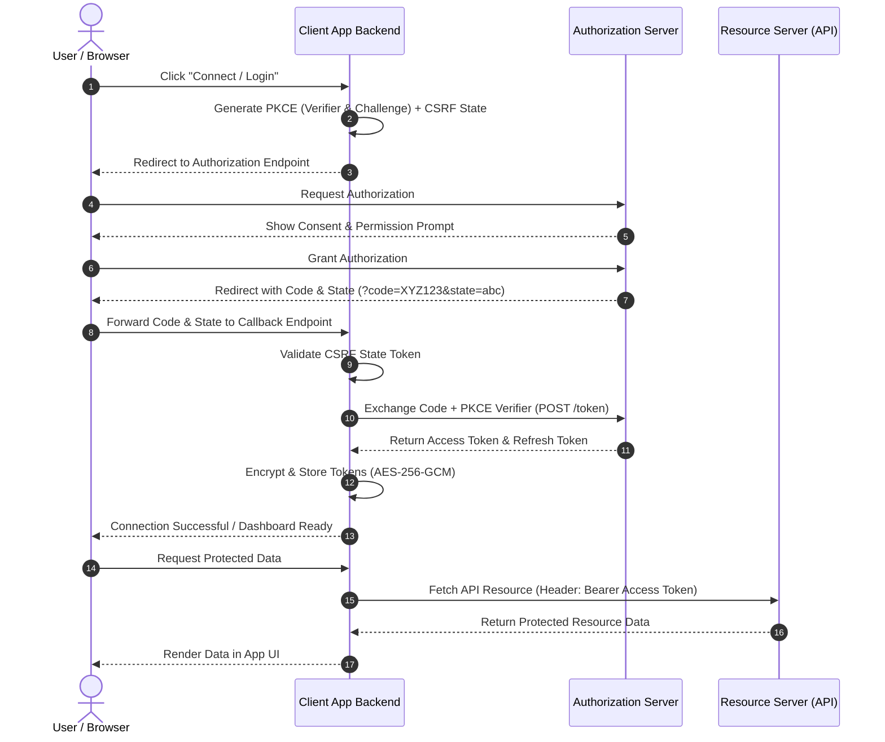

Modern web applications frequently need to request authorization to access user data hosted on external platforms without handling user passwords directly. **OAuth 2.0** (RFC 6749) is the industry-standard protocol designed specifically for delegated authorization.

While OAuth 2.0 is conceptually straight-forward, implementing it correctly in production requires robust security measures—including state parameter verification for CSRF protection, Proof Key for Code Exchange (PKCE) for authorization code interception defense, token refreshing, and encrypted persistence.

In this guide, we cover core OAuth 2.0 roles, walk through the complete Authorization Code Grant sequence, and implement a production-ready, framework-agnostic TypeScript backend solution.

---

## Key OAuth 2.0 Roles

OAuth 2.0 categorizes all entities into four distinct roles:

1. **Resource Owner**: The user who owns the data and grants access to their account.
2. **Client**: The application requesting access to the user's account data.
3. **Authorization Server**: The server that authenticates the user, obtains authorization, and issues access tokens.
4. **Resource Server**: The API server hosting the protected user resources, accepting requests with valid access tokens.

---

## The Complete Authorization Code Grant Sequence

The **Authorization Code Grant with PKCE** is the safest and recommended OAuth 2.0 flow for both server-side and client-side applications.



> [!NOTE]
> **Sequence Credit & Reference**: Diagram based on standard OAuth 2.0 RFC 6749 protocol sequence enhanced with RFC 7636 PKCE security extensions.

---

## Step 1: Generating PKCE Challenge & Initiating Authorization

To guard against authorization code interception attacks, generate a high-entropy cryptographically random `code_verifier` and derive a SHA-256 `code_challenge` (PKCE). Also create a unique `state` token to prevent Cross-Site Request Forgery (CSRF).

```typescript
import { Router, Request, Response } from 'express';
import crypto from 'crypto';

const router = Router();

// Helper: Base64URL encoding without padding
function base64UrlEncode(buffer: Buffer): string {
  return buffer.toString('base64')
    .replace(/=/g, '')
    .replace(/\+/g, '-')
    .replace(/\//g, '_');
}

// Generate PKCE code verifier and SHA-256 challenge
function generatePKCE() {
  const verifier = base64UrlEncode(crypto.randomBytes(32));
  const challenge = base64UrlEncode(
    crypto.createHash('sha256').update(verifier).digest()
  );
  return { verifier, challenge };
}

router.get('/auth/login', (req: Request, res: Response) => {
  // 1. Generate CSRF state token
  const state = crypto.randomBytes(32).toString('hex');
  
  // 2. Generate PKCE verifier and challenge
  const { verifier, challenge } = generatePKCE();

  // Store state & verifier in HTTP-only encrypted session cookies
  res.cookie('oauth_state', state, { httpOnly: true, secure: true, sameSite: 'lax' });
  res.cookie('oauth_verifier', verifier, { httpOnly: true, secure: true, sameSite: 'lax' });

  // 3. Construct Authorization URL
  const authUrl = new URL(process.env.OAUTH_AUTHORIZE_ENDPOINT!);
  authUrl.searchParams.append('response_type', 'code');
  authUrl.searchParams.append('client_id', process.env.OAUTH_CLIENT_ID!);
  authUrl.searchParams.append('redirect_uri', process.env.OAUTH_REDIRECT_URI!);
  authUrl.searchParams.append('scope', 'read write profile');
  authUrl.searchParams.append('state', state);
  authUrl.searchParams.append('code_challenge', challenge);
  authUrl.searchParams.append('code_challenge_method', 'S256');

  // Redirect browser to Authorization Server
  res.redirect(authUrl.toString());
});
```

---

## Step 2: Callback Handling & State Verification

When the Authorization Server redirects the user back with an authorization code, verify the `state` parameter before processing the authorization code.

```typescript
router.get('/auth/callback', async (req: Request, res: Response) => {
  const { code, state } = req.query;
  const savedState = req.cookies.oauth_state;
  const codeVerifier = req.cookies.oauth_verifier;

  // Clear state & verifier cookies
  res.clearCookie('oauth_state');
  res.clearCookie('oauth_verifier');

  // 1. Validate CSRF state token
  if (!state || !savedState || state !== savedState) {
    return res.status(403).json({ error: 'Invalid state token: potential CSRF attempt' });
  }

  if (!code || typeof code !== 'string' || !codeVerifier) {
    return res.status(400).json({ error: 'Missing authorization code or PKCE verifier' });
  }

  try {
    // 2. Exchange authorization code for access & refresh tokens
    const tokens = await exchangeCodeForTokens(code, codeVerifier);

    // 3. Persist tokens securely (encrypted)
    await saveUserTokens(tokens);

    return res.redirect('/dashboard?auth=success');
  } catch (err) {
    console.error('Token exchange error:', err);
    return res.status(500).json({ error: 'Authentication failed during token exchange' });
  }
});
```

---

## Step 3: Server-Side Token Exchange

Send a server-to-server `POST` request to the token endpoint with `grant_type=authorization_code`, passing the original `code_verifier`.

```typescript
interface OAuthTokens {
  access_token: string;
  refresh_token?: string;
  expires_in: number;
  token_type: string;
}

async function exchangeCodeForTokens(code: string, codeVerifier: string): Promise<OAuthTokens> {
  const params = new URLSearchParams({
    grant_type: 'authorization_code',
    client_id: process.env.OAUTH_CLIENT_ID!,
    client_secret: process.env.OAUTH_CLIENT_SECRET!,
    redirect_uri: process.env.OAUTH_REDIRECT_URI!,
    code: code,
    code_verifier: codeVerifier,
  });

  const response = await fetch(process.env.OAUTH_TOKEN_ENDPOINT!, {
    method: 'POST',
    headers: { 'Content-Type': 'application/x-www-form-urlencoded' },
    body: params.toString(),
  });

  if (!response.ok) {
    const errorBody = await response.text();
    throw new Error(`Token request failed [${response.status}]: ${errorBody}`);
  }

  return (await response.json()) as OAuthTokens;
}
```

---

## Step 4: Token Refresh Flow

Access tokens are short-lived (e.g., 1 hour). When an access token expires, use the `refresh_token` to request a new access token without requiring the user to re-authenticate.

```typescript
async function refreshAccessToken(refreshToken: string): Promise<OAuthTokens> {
  const params = new URLSearchParams({
    grant_type: 'refresh_token',
    client_id: process.env.OAUTH_CLIENT_ID!,
    client_secret: process.env.OAUTH_CLIENT_SECRET!,
    refresh_token: refreshToken,
  });

  const response = await fetch(process.env.OAUTH_TOKEN_ENDPOINT!, {
    method: 'POST',
    headers: { 'Content-Type': 'application/x-www-form-urlencoded' },
    body: params.toString(),
  });

  if (!response.ok) {
    throw new Error(`Failed to refresh token: ${response.statusText}`);
  }

  return (await response.json()) as OAuthTokens;
}
```

---

## Step 5: AES-256-GCM Encrypted Storage

Access and refresh tokens provide full authorization to user accounts. Never store tokens in plain text in database tables. Encrypt them using **AES-256-GCM**.

```typescript
import crypto from 'crypto';

const ALGORITHM = 'aes-256-gcm';
const KEY = Buffer.from(process.env.ENCRYPTION_KEY_HEX!, 'hex'); // 32 bytes

export function encrypt(text: string) {
  const iv = crypto.randomBytes(12);
  const cipher = crypto.createCipheriv(ALGORITHM, KEY, iv);
  
  let encrypted = cipher.update(text, 'utf8', 'hex');
  encrypted += cipher.final('hex');
  
  const tag = cipher.getAuthTag().toString('hex');
  
  return {
    ciphertext: encrypted,
    iv: iv.toString('hex'),
    tag,
  };
}

export function decrypt(ciphertext: string, iv: string, tag: string): string {
  const decipher = crypto.createDecipheriv(
    ALGORITHM,
    KEY,
    Buffer.from(iv, 'hex')
  );
  decipher.setAuthTag(Buffer.from(tag, 'hex'));
  
  let decrypted = decipher.update(ciphertext, 'hex', 'utf8');
  decrypted += decipher.final('utf8');
  
  return decrypted;
}
```

---

## OAuth 2.0 Production Security Guidelines

> [!TIP]
> **Essential Security Checklist:**
> 1. **Always Use PKCE**: Enforce RFC 7636 PKCE (`code_challenge_method=S256`) for all client types to neutralize authorization code injection attacks.
> 2. **Strict Redirect URI Matching**: Register exact redirect URIs on the Authorization Server. Never allow wildcard subdomains or open redirects.
> 3. **HTTP-Only Cookies for State**: Store `state` and `code_verifier` in `HttpOnly`, `Secure`, `SameSite=Lax` cookies to prevent client-side JavaScript access (XSS defense).
> 4. **Keep Secrets Server-Side**: Never include `client_secret` in single-page applications or mobile binaries.

---

## Summary

OAuth 2.0 provides a secure, decoupled mechanism for delegated authorization. By implementing PKCE, enforcing cryptographic state validation, handling automatic token refresh cycles, and storing tokens using AES-256-GCM encryption, you establish a resilient authentication architecture for modern applications.

---

## References

- [RFC 6749: The OAuth 2.0 Authorization Framework](https://datatracker.ietf.org/doc/html/rfc6749)
- [RFC 7636: Proof Key for Code Exchange (PKCE)](https://datatracker.ietf.org/doc/html/rfc7636)
- [RFC 6819: OAuth 2.0 Threat Model and Security Considerations](https://datatracker.ietf.org/doc/html/rfc6819)
- [OAuth 2.0 Security Best Current Practice (IETF Draft)](https://datatracker.ietf.org/doc/html/draft-ietf-oauth-security-topics)
