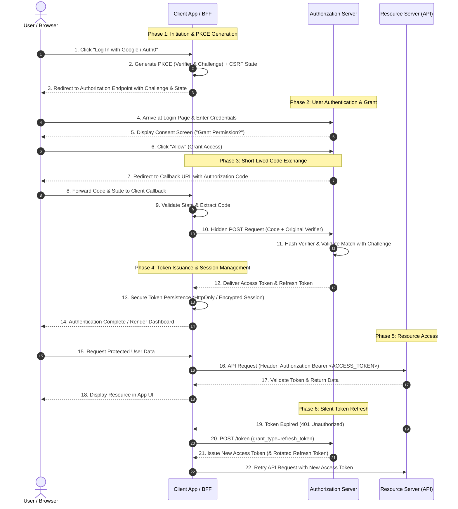

Modern web applications frequently need to request authorization to access user data hosted on external platforms without handling user credentials directly. **OAuth 2.0** ([RFC 6749](https://datatracker.ietf.org/doc/html/rfc6749)) is the industry-standard framework for delegated authorization.

While OAuth 2.0 is conceptually straightforward, implementing it securely in production requires understanding core concepts—such as who generates PKCE parameters, why authorization codes are single-use tickets, how modern token storage defenses (such as BFF and HttpOnly cookies) prevent Cross-Site Scripting (XSS), and how every phase of the authorization lifecycle fits together chronologically.

In this guide, we break down the fundamental OAuth 2.0 concepts, detail the 6-phase chronological interaction flow, and present a production-ready TypeScript backend implementation.

---

## Core Concepts & Architectural Misconceptions

When implementing OAuth 2.0 in production environments, developers frequently encounter architectural confusion regarding cryptographic parameter ownership, key lifetimes, and client-side token persistence vulnerabilities. Addressing these core design decisions early prevents high-risk security flaws such as credential leakage, authorization code interception, and session hijacking. Before walking through the step-by-step execution lifecycle, let's clarify three critical concepts that form the backbone of a secure OAuth 2.0 integration:

### 1. Who Generates PKCE?
The **Client application** (either a Single Page Application in the browser or a Backend-for-Frontend / BFF) generates the **Proof Key for Code Exchange (PKCE)** parameters before initiating authentication:
* **Code Verifier**: A cryptographically random, high-entropy secret string created locally. The client holds onto this secret and **never** sends it in the initial browser request.
* **Code Challenge**: A Base64URL-encoded SHA-256 hash derived from the `code_verifier`. Only this hashed challenge is sent to the Authorization Server in the first step.

### 2. The Authorization Code is a "Single-Use Ticket"
Developers sometimes mistake the temporary string attached to the callback URL for a static access key or "duplicate key". In reality, the **Authorization Code** is a short-lived, **single-use ticket**. It cannot be used to access APIs directly; it can only be redeemed *once* at the Authorization Server's `/token` endpoint in exchange for real access and refresh tokens. Once redeemed, any subsequent attempt to use the same code is rejected.

### 3. Token Storage Security & XSS Mitigation
Where you store tokens determines your application's security posture:
* **Avoid LocalStorage**: Storing access tokens in browser `localStorage` or `sessionStorage` leaves them vulnerable to exfiltration via Cross-Site Scripting (XSS) attacks.
* **HttpOnly Cookies**: Storing tokens in `HttpOnly`, `Secure`, `SameSite=Lax` cookies prevents client-side JavaScript from accessing token strings.
* **Backend-for-Frontend (BFF) Pattern**: For Single Page Applications (SPAs), the recommended pattern is a BFF. The BFF handles the OAuth token exchange, stores tokens securely on the server (or in encrypted HttpOnly session cookies), and proxy-passes API requests, ensuring access tokens are never exposed to browser memory.

---

## Key OAuth 2.0 Roles

OAuth 2.0 categorizes all entities into four distinct roles:

1. **Resource Owner**: The end user who owns the account data and grants access.
2. **Client**: The application requesting access to user data on behalf of the Resource Owner.
3. **Authorization Server**: The server that authenticates the user, validates consent, and issues access and refresh tokens.
4. **Resource Server**: The API server hosting protected user resources, accepting requests authorized by valid access tokens.

---

## Complete OAuth 2.0 Sequence Overview

The diagram below illustrates the end-to-end flow of the Authorization Code Grant with PKCE across all four entities:



> [!NOTE]
> **Protocol Specification**: This sequence implements OAuth 2.0 ([RFC 6749](https://datatracker.ietf.org/doc/html/rfc6749)) extended with Proof Key for Code Exchange ([RFC 7636](https://datatracker.ietf.org/doc/html/rfc7636)) and OAuth 2.0 Security Best Current Practices.

---

## ⏱️ Detailed Step-by-Step Chronological Interaction Flow

Here is the step-by-step breakdown of how the OAuth 2.0 authorization process unfolds chronologically across six key phases:

### Phase 1: Initiation & PKCE Generation
1. **User Action**: The user visits your application and clicks "Log In with Google / Auth0".
2. **Client Generates PKCE**: The Client App (or BFF) immediately generates two cryptographic values:
   * **Code Verifier**: A high-entropy, random secret string (e.g., 32–128 unreserved characters). The client retains this string securely and hides it from public view.
   * **Code Challenge**: A SHA-256 hash of the verifier, Base64URL-encoded.
3. **The Redirect**: The client redirects the user's browser to the Authorization Server's authorization endpoint. The redirect URL includes:
   * `client_id`: The client identifier issued during app registration.
   * `scope`: Requested permissions (e.g., `read:profile email`).
   * `code_challenge`: The SHA-256 hashed verifier.
   * `code_challenge_method`: Specified as `S256`.
   * `state`: A cryptographically random string to guard against Cross-Site Request Forgery (CSRF).

### Phase 2: User Authentication & Grant
4. **User Logs In**: The browser arrives at the Authorization Server's login portal. The user enters their login credentials.
5. **Consent Screen**: The Authorization Server asks the user: *"Do you grant this application permission to access your profile?"*
6. **User Grants Access**: The user clicks **Allow**, authorizing the requested scopes.

### Phase 3: The Short-Lived Code Exchange
7. **Issuing the Code**: The Authorization Server redirects the user's browser back to the Client App's registered callback URL. Appended to this redirect is a temporary **Authorization Code** (the single-use ticket).
8. **Sending to the Backend**: The Client App extracts the Authorization Code and state token from the incoming request.
9. **The Token Request**: The Client App executes a direct, hidden server-to-server (or background) `POST` API call to the Authorization Server's `/token` endpoint, passing:
   * `grant_type=authorization_code`
   * `code`: The single-use authorization code.
   * `code_verifier`: The original raw cryptographic secret generated in Phase 1.
   * `redirect_uri`: Matching redirect URL.
10. **PKCE Verification**: The Authorization Server SHA-256 hashes the received `code_verifier` and verifies that it produces an exact match with the `code_challenge` sent in Phase 1.
    > [!IMPORTANT]
    > **Why PKCE Verification Matters**: PKCE proves that the entity requesting the tokens is the exact same application that initiated the login request. Even if an attacker intercepts the Authorization Code from the browser redirect, they do not possess the secret `code_verifier`, rendering the stolen code useless.

### Phase 4: Token Issuance & Session Management
11. **Tokens Delivered**: Upon successful PKCE verification, the Authorization Server responds with a JSON payload containing:
    * **Access Token**: Short-lived credential (typically 15 to 60 minutes) used to access protected resources.
    * **Refresh Token**: Long-lived credential (days, weeks, or months) used to obtain new access tokens.
12. **Secure Storage**: Tokens are stored using secure persistence mechanisms:
    * Stored in encrypted server-side sessions, or
    * Sent to the browser in `HttpOnly`, `Secure`, `SameSite=Lax` cookies, or
    * Kept in isolated memory inside a BFF application layer to prevent XSS theft.

### Phase 5: Accessing the Resource Server (API)
13. **Data Request**: When the user requests profile or application data, the Client App constructs an HTTP request targeting the Resource Server.
14. **Passing the Token**: The Client attaches the Access Token to the HTTP request header:
    ```http
    Authorization: Bearer <ACCESS_TOKEN>
    ```
15. **Data Returned**: The Resource Server validates the token's cryptographic signature and expiration time, and returns the requested data.

### Phase 6: Refreshing the Token
16. **Token Expiry**: When the Access Token expires, subsequent resource requests return an HTTP `401 Unauthorized` response.
17. **Silent Refresh**: Without prompting the user to log in again, the Client App automatically sends a `POST` request to the Authorization Server's `/token` endpoint with `grant_type=refresh_token` and the stored `refresh_token`.
18. **New Pair Issued**: The Authorization Server validates the Refresh Token and issues a new Access Token (and optionally rotates the Refresh Token). The application updates its secure storage and retries the original API request seamlessly.

---

## Production Implementation (TypeScript & Express)

Below is a complete TypeScript backend example demonstrating PKCE generation, state verification, token exchange, and AES-256-GCM encrypted persistence.

### Step 1: PKCE Generation & Authorization Endpoint

```typescript
import { Router, Request, Response } from 'express';
import crypto from 'crypto';

const router = Router();

// Base64URL encoding helper (RFC 7636 spec)
function base64UrlEncode(buffer: Buffer): string {
  return buffer.toString('base64')
    .replace(/=/g, '')
    .replace(/\+/g, '-')
    .replace(/\//g, '_');
}

// Generate PKCE code_verifier and S256 code_challenge
function generatePKCE() {
  const verifier = base64UrlEncode(crypto.randomBytes(32));
  const challenge = base64UrlEncode(
    crypto.createHash('sha256').update(verifier).digest()
  );
  return { verifier, challenge };
}

router.get('/auth/login', (req: Request, res: Response) => {
  // 1. Generate CSRF state token
  const state = crypto.randomBytes(32).toString('hex');
  
  // 2. Generate PKCE verifier and challenge (Client side)
  const { verifier, challenge } = generatePKCE();

  // 3. Store state & hidden verifier in HttpOnly cookies
  res.cookie('oauth_state', state, { httpOnly: true, secure: true, sameSite: 'lax' });
  res.cookie('oauth_verifier', verifier, { httpOnly: true, secure: true, sameSite: 'lax' });

  // 4. Construct Authorization Redirect URL
  const authUrl = new URL(process.env.OAUTH_AUTHORIZE_ENDPOINT!);
  authUrl.searchParams.append('response_type', 'code');
  authUrl.searchParams.append('client_id', process.env.OAUTH_CLIENT_ID!);
  authUrl.searchParams.append('redirect_uri', process.env.OAUTH_REDIRECT_URI!);
  authUrl.searchParams.append('scope', 'openid profile email');
  authUrl.searchParams.append('state', state);
  authUrl.searchParams.append('code_challenge', challenge);
  authUrl.searchParams.append('code_challenge_method', 'S256');

  // Redirect browser to Authorization Server
  res.redirect(authUrl.toString());
});
```

### Step 2: Callback Handling & PKCE Verification

```typescript
router.get('/auth/callback', async (req: Request, res: Response) => {
  const { code, state } = req.query;
  const savedState = req.cookies.oauth_state;
  const codeVerifier = req.cookies.oauth_verifier;

  // Clear temporary state & verifier cookies immediately
  res.clearCookie('oauth_state');
  res.clearCookie('oauth_verifier');

  // Validate CSRF state token
  if (!state || !savedState || state !== savedState) {
    return res.status(403).json({ error: 'CSRF State mismatch detected' });
  }

  if (!code || typeof code !== 'string' || !codeVerifier) {
    return res.status(400).json({ error: 'Missing single-use authorization code or PKCE verifier' });
  }

  try {
    // Exchange single-use authorization code + PKCE verifier for tokens
    const tokens = await exchangeCodeForTokens(code, codeVerifier);

    // Save tokens securely using AES-256-GCM encryption
    await saveUserTokens(tokens);

    return res.redirect('/dashboard?auth=success');
  } catch (err) {
    console.error('Token exchange failure:', err);
    return res.status(500).json({ error: 'Authentication failed during token exchange' });
  }
});
```

### Step 3: Token Exchange & Refresh Logic

```typescript
interface OAuthTokens {
  access_token: string;
  refresh_token?: string;
  expires_in: number;
  token_type: string;
}

// Exchange single-use Authorization Code + PKCE Verifier for tokens
async function exchangeCodeForTokens(code: string, codeVerifier: string): Promise<OAuthTokens> {
  const params = new URLSearchParams({
    grant_type: 'authorization_code',
    client_id: process.env.OAUTH_CLIENT_ID!,
    client_secret: process.env.OAUTH_CLIENT_SECRET!,
    redirect_uri: process.env.OAUTH_REDIRECT_URI!,
    code: code,
    code_verifier: codeVerifier,
  });

  const response = await fetch(process.env.OAUTH_TOKEN_ENDPOINT!, {
    method: 'POST',
    headers: { 'Content-Type': 'application/x-www-form-urlencoded' },
    body: params.toString(),
  });

  if (!response.ok) {
    const errorText = await response.text();
    throw new Error(`Token exchange failed [${response.status}]: ${errorText}`);
  }

  return (await response.json()) as OAuthTokens;
}

// Silent Token Refresh using Refresh Token
async function refreshAccessToken(refreshToken: string): Promise<OAuthTokens> {
  const params = new URLSearchParams({
    grant_type: 'refresh_token',
    client_id: process.env.OAUTH_CLIENT_ID!,
    client_secret: process.env.OAUTH_CLIENT_SECRET!,
    refresh_token: refreshToken,
  });

  const response = await fetch(process.env.OAUTH_TOKEN_ENDPOINT!, {
    method: 'POST',
    headers: { 'Content-Type': 'application/x-www-form-urlencoded' },
    body: params.toString(),
  });

  if (!response.ok) {
    throw new Error(`Token refresh failed [${response.status}]: ${response.statusText}`);
  }

  return (await response.json()) as OAuthTokens;
}
```

### Step 4: AES-256-GCM Encrypted Token Persistence

```typescript
import crypto from 'crypto';

const ALGORITHM = 'aes-256-gcm';
const KEY = Buffer.from(process.env.ENCRYPTION_KEY_HEX!, 'hex'); // Must be 32 bytes (256 bits)

export function encrypt(text: string) {
  const iv = crypto.randomBytes(12);
  const cipher = crypto.createCipheriv(ALGORITHM, KEY, iv);
  
  let encrypted = cipher.update(text, 'utf8', 'hex');
  encrypted += cipher.final('hex');
  
  const tag = cipher.getAuthTag().toString('hex');
  
  return {
    ciphertext: encrypted,
    iv: iv.toString('hex'),
    tag,
  };
}

export function decrypt(ciphertext: string, iv: string, tag: string): string {
  const decipher = crypto.createDecipheriv(
    ALGORITHM,
    KEY,
    Buffer.from(iv, 'hex')
  );
  decipher.setAuthTag(Buffer.from(tag, 'hex'));
  
  let decrypted = decipher.update(ciphertext, 'hex', 'utf8');
  decrypted += decipher.final('utf8');
  
  return decrypted;
}
```

---

## Production Security Checklist

> [!TIP]
> **Essential Security Checklist:**
> 1. **Always Enforce PKCE (`S256`)**: Never rely solely on implicit grant or authorization code flow without PKCE. Use `S256` for all client types (public, SPAs, native apps, confidential clients).
> 2. **Strict Redirect URI Matching**: Register exact, fully qualified redirect URIs on the Authorization Server. Never allow wildcards or open redirects.
> 3. **Secure Storage (HttpOnly / BFF)**: Shield access and refresh tokens from JavaScript exfiltration. Use `HttpOnly`, `Secure`, `SameSite=Lax` cookies or a Backend-for-Frontend (BFF) architecture.
> 4. **Refresh Token Rotation**: Implement refresh token rotation so that each refresh token can only be used once, issuing a new pair on every refresh request and invalidating entire token families upon detecting reuse.
> 5. **Cryptographic State Validation**: Generate cryptographically secure random `state` strings to prevent Cross-Site Request Forgery (CSRF).

---

## Summary

OAuth 2.0 with PKCE offers a robust, industry-proven framework for delegated authorization. By understanding that PKCE parameters are client-generated, treating authorization codes as single-use exchange tickets, adopting secure storage mechanisms (such as HttpOnly cookies or BFF patterns), and following a structured 6-phase chronological interaction flow, you build secure authentication architectures resilient to modern attack vectors.

---

## References

- [RFC 6749: The OAuth 2.0 Authorization Framework](https://datatracker.ietf.org/doc/html/rfc6749)
- [RFC 7636: Proof Key for Code Exchange (PKCE)](https://datatracker.ietf.org/doc/html/rfc7636)
- [RFC 6819: OAuth 2.0 Threat Model and Security Considerations](https://datatracker.ietf.org/doc/html/rfc6819)
- [OAuth 2.0 Security Best Current Practice (IETF Draft)](https://datatracker.ietf.org/doc/html/draft-ietf-oauth-security-topics)
