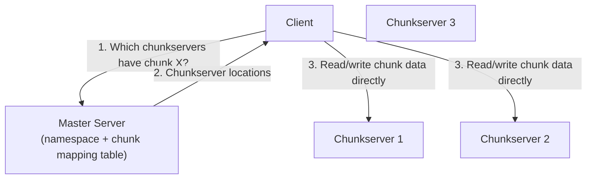
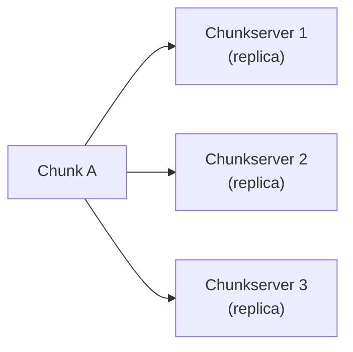
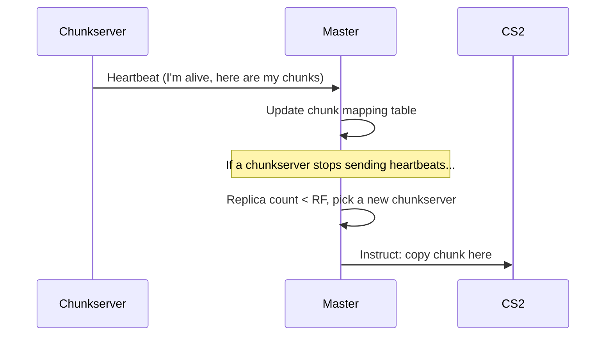
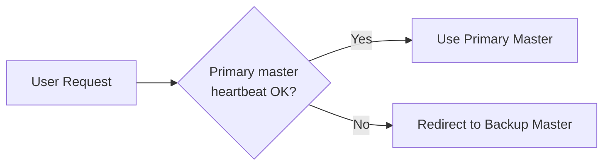

Every operating system you've used — Windows, Linux, macOS — manages files the same basic way: it divides the disk into fixed-size **blocks** (often 4 KB), and every file you save is split across as many blocks as it needs.

```
number of blocks required = total file size / block size
```

A 12 KB photo on a 4 KB block size file system needs **3 blocks**. Those 3 blocks don't have to be next to each other on disk — they can be scattered anywhere. So the file system keeps a **main index** (like a table of contents) that records which blocks belong to which file, and in what order, so it can reassemble the file when you open it.

This works great on a single machine. But what happens when your "file" is actually the entire internet's worth of web pages, and your disk isn't big enough — no matter how large a single machine you buy?

---

## The Problem: One Disk Isn't Enough

Google's early problem was simple to state and brutal to solve: they needed to store and process **enormous** amounts of data (web crawls, logs, indexes) that no single machine's disk could hold.

The obvious fix — "just add a bigger, more expensive server" — doesn't scale:

- It's **costlier**: enterprise-grade, high-capacity storage hardware is expensive.
- It doesn't fix **scalability**: eventually you hit the biggest disk money can buy, and you still need more.
- It creates a **single point of failure**: if that one expensive machine dies, everything on it is gone.

So instead of one giant reliable machine, Google took the opposite approach: use **thousands of cheap, commodity machines**, expect them to fail regularly, and design the software to tolerate that. That software is the **Google File System (GFS)**, published by Ghemawat, Gobioff, and Leung in 2003.

---

## The Core Idea: Split Files Into Chunks

GFS applies the same idea as a local file system, just at a massive scale. Instead of 4 KB blocks, a file is split into **chunks of 64 MB** each. Each chunk is stored as a plain file on a regular machine called a **chunkserver**.

Sitting in front of all the chunkservers is a single **master** server. When a client wants to read or write a file, it doesn't fetch the data through the master — it just asks the master "which chunkservers hold the chunks for this file?", and then talks **directly** to those chunkservers to move the actual data. This keeps the master out of the way of heavy data traffic.



Since there are now thousands of chunkservers instead of one disk, a failure is no longer rare — it's **expected**. Handling that reality is the entire point of GFS's design.

---

## Replication: Surviving Machine Failures

If each chunk only existed on one chunkserver, losing that machine would mean losing that piece of data forever. GFS solves this with **replication**: every chunk is copied to multiple chunkservers, typically **3** (the "replication factor" or RF).



> [!NOTE]
> Replication isn't just about surviving crashes — it also spreads read traffic across multiple machines, so popular chunks don't bottleneck on a single server.

But replicas can go down too. GFS needs a way to notice when that happens and fix it automatically.

### Heartbeats Keep the Master's Map Up to Date

Every chunkserver periodically sends a **heartbeat** message to the master. The heartbeat reports which chunks that server currently holds and confirms it's still alive. The master uses these heartbeats to keep its in-memory **chunk mapping table** (which chunkserver holds which chunk) accurate at all times.

If a chunkserver misses its heartbeats, the master assumes it's dead. It then checks: does this chunk still have enough healthy replicas to match the replication factor? If not, the master picks another chunkserver and copies the chunk there — automatically re-replicating until the RF is satisfied again.



This self-healing loop is what makes GFS resilient — no human has to notice a dead disk and manually replace the data; the system keeps chasing the target replication factor on its own.

---

## What If the Master Itself Dies?

The master is a single machine holding critical metadata: the file namespace, the file-to-chunk mapping, and (via heartbeats) the chunk locations. If it's a single point of failure, the whole design falls apart.

GFS addresses this by having the **primary master** continuously stream its state to a **backup (shadow) master**, which stays up to date with almost all the latest metadata. Both are monitored with heartbeats as well:



If the primary stops responding, requests are redirected to the backup, which can take over using its near-current copy of the metadata — minimizing downtime for a system that may be coordinating access to hundreds of terabytes of data.

---

## Why 64 MB Chunks Instead of 4 KB Blocks?

This is the detail that surprises most people coming from regular file systems. GFS deliberately uses a **much larger** chunk size than a typical OS block:

- **Fewer chunks per file** means the master's metadata table stays small enough to fit in memory, even for huge files.
- **Fewer round trips to the master**: a client that wants to read a large file only needs to ask the master for chunk locations once in a while, not for every few KB.
- GFS was built for **large, sequential reads/writes** (think: multi-gigabyte log files and web crawl data), not for lots of small random-access files — so big chunks match the workload.

---

## Quick Comparison: Local File System vs. GFS

| Aspect | Local File System | Google File System |
|---|---|---|
| Unit of storage | Block (e.g., 4 KB) | Chunk (64 MB) |
| Stored on | One disk | Thousands of chunkservers |
| Failure handling | None (single disk) | Replication (RF, typically 3) |
| Metadata owner | OS file index | Single master (+ backup) |
| Failure detection | N/A | Heartbeats between chunkservers and master |
| Master failure | N/A | Backup master takes over |

---

## The Legacy: HDFS

GFS was never open-sourced, but its design directly inspired the **Hadoop Distributed File System (HDFS)**, which follows the same blueprint: a **NameNode** (playing the role of GFS's master) tracks metadata, while **DataNodes** (playing the role of chunkservers) store replicated blocks of data. If you've worked with Hadoop, Spark, or any big-data pipeline, you've already been relying on ideas straight out of the GFS paper.

---

## The Bottom Line

GFS proved that you don't need expensive, reliable hardware to build a reliable storage system — you need software that **assumes failure is normal** and designs around it:

1. **Split large files into big chunks** (64 MB) instead of tiny blocks, to keep metadata small and reads efficient.
2. **Replicate every chunk** across multiple chunkservers so no single failure loses data.
3. **Use heartbeats** to continuously detect dead servers and automatically re-replicate chunks to maintain the target replication factor.
4. **Keep a backup master** in sync with the primary, so metadata — the map to everything — survives even if the master goes down.

The next time you hear "we store petabytes of data across thousands of commodity servers," this heartbeat-driven, self-healing chunk architecture is very likely doing the heavy lifting behind the scenes.

---

## References
1. [The Google File System — Ghemawat, Gobioff, Leung (SOSP 2003)](https://research.google/pubs/the-google-file-system/)
2. [Apache Hadoop Distributed File System (HDFS) Architecture](https://hadoop.apache.org/docs/stable/hadoop-project-dist/hadoop-hdfs/HdfsDesign.html)
