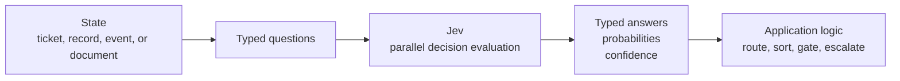
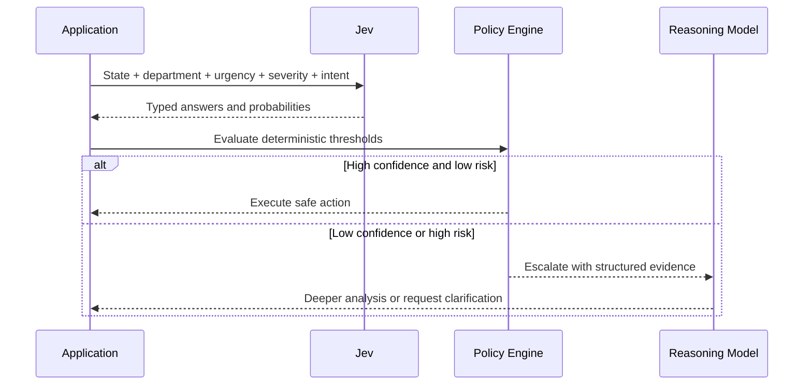
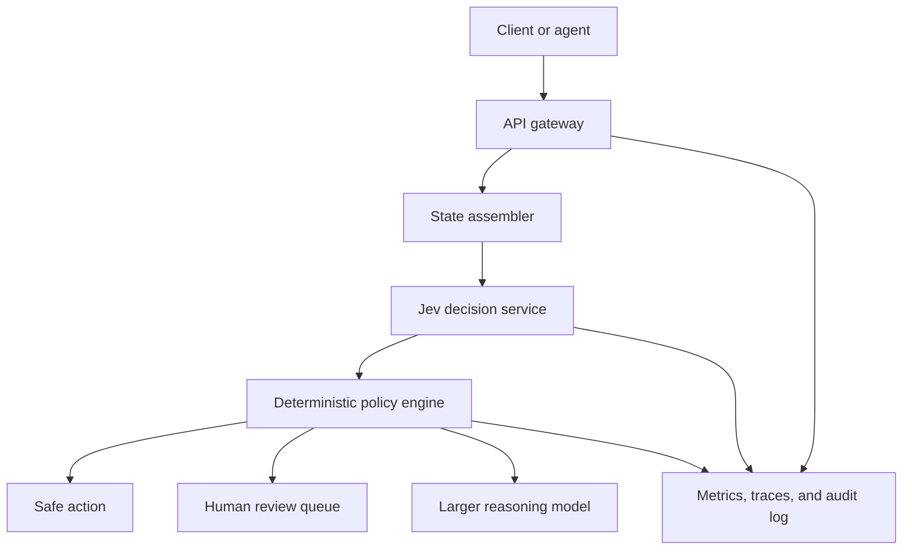

Most language models are designed around a human interaction: a user sends text, the model generates more text, and the application parses that result if it needs a decision. That interface is excellent for open-ended work, but it is a poor fit for software that must repeatedly choose a route, classify a record, score risk, or decide whether an action is safe.

Jev is TypeSafe AI's first **System One** model. Instead of generating a reply, it evaluates a state through typed questions and returns values that software can branch on directly. The important architectural shift is not simply "a smaller LLM." It is a different contract between a model and the program that calls it.

This article analyzes Jev as a decision layer: what it promises, how its primitives compose, where it fits in a production architecture, and where an ordinary reasoning model is still the better tool.

---

## The Interface Mismatch

A traditional LLM call often looks like this:

1. Put a question and context in a prompt.
2. Generate a sequence of text tokens.
3. Ask the model to return JSON or another format.
4. Parse the result.
5. Validate the result.
6. Retry when parsing or validation fails.

The generated string is flexible, but software needs a predictable contract. A route must be one of the routes the application supports. A tool argument must match the function signature. A risk decision must have a threshold. A malformed response can become an outage or an unsafe action.

A System One model changes the direction of the interface. The caller defines the possible answer space first:

```text
unstructured state + typed questions -> typed decisions + probabilities
```

The model does not need to invent a label and then hope that the label is valid. The application already decides what counts as a valid label.

> [!NOTE]
> Jev is not a text generator. It accepts text, JSON, and arrays of text, then returns `Choice`, `Score`, or `Noul` answers. It does not write code, explanations, or conversational replies.

---

## What Jev Actually Does

Jev takes two main inputs:

- **State**: the text or structured text data to evaluate.
- **Questions**: named judgments to make about that state.

The questions in one request share the same state. TypeSafe documents that they are evaluated independently and in parallel. The result is a typed answer under each question ID.



This is a useful mental model: Jev is a probabilistic decision function that sits inside a larger program. It is not the database, the workflow engine, the policy authorizer, or the human escalation system. Those responsibilities remain in code and surrounding services.

### The three primitives

| Primitive | Use it for | Typical result |
|---|---|---|
| `Choice` | Select one option from a defined set | Selected value, distribution across options, confidence |
| `Score` | Place a state on an ordered scale | Position on the scale, distribution across levels, confidence |
| `Noul` | Evaluate a yes/no proposition | Probability that the proposition is true |

The primitive should match the decision your code needs to make. Use `Choice` for routing, `Score` for a spectrum such as frustration or severity, and `Noul` for a binary question where the probability itself is useful.

A `Noul` value of `0.5` means the model assigns equal probability to yes and no. It does not mean that the application should invent a medium label. If you need an explicit spectrum, define one with `Score`.

---

## A Worked Example: Support-Ticket Triage

Imagine a support platform that receives messages like this:

```json
{
  "ticket_message": "The deploy failed twice and customers are seeing 500 errors. Can someone look now?",
  "order": {
    "id": "A-104",
    "charges": [
      { "amount_usd": 49, "status": "captured" },
      { "amount_usd": 49, "status": "captured" }
    ]
  },
  "refund_policy": "Duplicate charges are eligible for a refund."
}
```

Instead of asking Jev to "analyze this ticket and decide what to do," ask a few focused questions and keep policy in code.

```python
from typesafe_sdk import Choice, Noul, Score, TypeSafeClient

state = {
    "ticket_message": "The deploy failed twice and customers are seeing 500 errors. Can someone look now?",
    "order_id": "A-104",
    "refund_policy": "Duplicate charges are eligible for a refund.",
}

with TypeSafeClient() as client:
    response = client.system_one(
        state=state,
        questions={
            "department": Choice(
                instructions="Which team should handle this message?",
                criteria={
                    "technical": "Bugs, deployments, or integration problems",
                    "billing": "Payments or subscription problems",
                    "sales": "Pricing or account questions",
                },
            ),
            "urgency": Noul(
                instructions="Does the message require attention right now?",
            ),
            "severity": Score(
                instructions="How severe is the customer impact?",
                criteria=[
                    "No customer impact",
                    "Limited impact",
                    "Production service is degraded",
                    "Production service is unavailable",
                ],
            ),
        },
    )

answers = response.answers
print(answers["department"].choice)
print(answers["urgency"].noul)
print(answers["severity"].score)
```

The application can now combine the answers with deterministic rules:

```python
department = answers["department"].choice
urgency = answers["urgency"].noul
severity = answers["severity"].score

if severity >= 2 and urgency >= 0.8:
    route_to_on_call(department)
elif answers["department"].confidence < 0.6:
    route_to_human_review(state)
else:
    route_to_normal_queue(department)
```

The exact thresholds belong to the application. A read-only ticket can tolerate a lower threshold than a payment, account deletion, or production deployment. The model supplies evidence for the branch; the application owns the consequences.

---

## Why Batch Questions

One of the most important System One design rules is to ask related questions in one request. The model evaluates them in parallel against the same state, so adding a question should add little response time compared with making another network call.

This changes the usual agent-building instinct. Instead of asking one model call, waiting for the result, and then asking another question, the application can ask for all independent dimensions at once.



Batching is not a free substitute for question quality. If two questions are logically dependent, asking them together can be misleading. TypeSafe's guidance is to decompose independent judgments and compose them in code. A second request is appropriate when the first answer changes the state, the available options, or the data that the second question needs.

The practical pattern is:

1. Send independent questions in one call.
2. Combine the typed results in application code.
3. Use the first result to fetch more state or select the next stage only when the workflow truly depends on it.
4. Escalate instead of forcing a weak answer into a hard binary decision.

---

## Jev Is a Decision Layer, Not the Whole System

A production design should place Jev behind a small, stable application interface. That protects the rest of the system from provider-specific request and response details.



The state assembler should add only the context required for the decision. This reduces token use, improves latency, and limits unnecessary exposure of sensitive data. The policy engine should enforce permissions, rate limits, allowlists, idempotency, and risk rules. Jev must not be the only thing standing between an untrusted input and an irreversible action.

For a coding agent, the same pattern can protect tool execution. Jev can classify a proposed tool call as low risk, uncertain, or high risk. A high-risk call can require human approval, a narrow allowlist, a dry run, or a different execution path. This is a guardrail around the workflow, not a proof that the model is correct.

---

## Confidence Is a Control Signal

`Choice` and `Score` responses include a `confidence` value derived from the probability distribution. A concentrated distribution produces higher confidence; a flat distribution means that no option clearly wins.

That makes uncertainty actionable:

| Confidence range | Suggested behavior |
|---|---|
| High | Act automatically if the action is reversible or low risk |
| Medium | Confirm with the user, collect more context, or run a second check |
| Low | Route to a person or fall back to a deterministic rule |

Do not copy these boundaries blindly. Calibrate them with your own labeled examples and measure both the model's accuracy and the cost of false actions.

There is an important distinction between a probability and a guarantee. Calibration is a property measured across a population of predictions. A particular `0.95` answer can still be wrong. Likewise, a typed response can be perfectly valid but semantically incorrect. Constrained output prevents type errors; it does not prevent a wrong but valid choice.

> [!WARNING]
> Do not use vendor-reported latency, throughput, or calibration claims as a substitute for evaluation on your own state distribution. The launch material reports 70–500 ms response times and strong cost comparisons, but the model was still in early access and the underlying architecture and RLCD details were not fully published.

A useful evaluation set should include normal cases, ambiguous cases, adversarial wording, missing fields, and examples that force a human escalation. Track the answer, the confidence, the threshold, the final action, and the eventual outcome. The goal is not only to maximize accuracy; it is to keep the cost of uncertainty bounded.

---

## Where Jev Fits Beside an LLM

Jev should complement a general model rather than replace it blindly. The right question is not "Which model is best?" but "Which model is best for this particular decision?" That distinction keeps a fast classifier in the hot path, reserves expensive reasoning for ambiguous work, and prevents an application from paying generative-model costs for every small branch in a workflow.

### Good candidates for Jev

- Intent routing and model selection
- Support-ticket classification
- Document-type detection
- Filtering or reranking candidates
- Risk and urgency scoring
- Tool-risk gating
- High-volume map-reduce classification
- Real-time decisions where sub-second response matters

### Jobs that still need an LLM or deterministic software

- Open-ended writing and explanations
- Code generation across a large, changing surface
- Questions requiring several steps of intermediate reasoning
- Tasks that need a written rationale for an auditor
- Numeric or date arithmetic that must be exact
- Actions whose correctness can be checked directly with code, a compiler, or a test suite

The practical composition is simple: use a fast structured model for frequent, bounded decisions; use a larger reasoning or generative model for open-ended work; and use deterministic code for permissions, arithmetic, validation, and side effects.

This separation also makes model portability easier. The rest of the application should depend on an internal decision contract rather than on Jev's wire format. A future System One model, an encoder classifier, or a locally hosted model can be evaluated behind that same contract.

---

## The Broader System-Design Lens

The useful idea in Jev is not limited to one vendor's API. It is a decomposition pattern: turn an ambiguous, high-level request into small typed decisions, combine those decisions with explicit policy, and preserve an escalation path for uncertainty.

That is similar to the general system-design discipline described in [Laya Myadam's system-design framework](https://medium.com/@layamyadam8/part-3-system-design-framework-18d100a7c16e), which moves from requirements and capacity estimation to entities, APIs, data flow, high-level design, and deeper trade-offs. Her earlier [system-design series](https://medium.com/@layamyadam8/part-1-system-design-from-dosa-carts-to-chatgpt-why-systems-fail-and-how-to-build-ones-that-1e22abf65e98) is also a useful companion for the broader principle: a system becomes reliable when its responsibilities, boundaries, and failure behavior are explicit.

For a System One model, that framework translates into a few concrete questions:

1. **What is the state?** Which data does this decision actually need?
2. **What are the primitives?** Which questions have bounded, typed answers?
3. **What is the policy?** Which combinations of answers may trigger which actions?
4. **What happens when confidence is low?** Which deterministic fallback or human path is available?
5. **How will we measure it?** Which outcomes prove that the decision layer is useful and safe?

Answer those questions before adding prompts, agents, or more model calls.

---

## Key Takeaways

Jev should be understood as a **System One decision interface**, not as a smaller chatbot:

- The caller defines the answer space through `Choice`, `Score`, and `Noul` questions.
- Jev returns typed answers and probability distributions instead of generated text.
- Independent questions are evaluated in parallel against the same state.
- Confidence and probabilities should drive routing, confirmation, and escalation.
- Deterministic application code must still own permissions, validation, policy, and side effects.
- Vendor claims require local evaluation, especially when the model architecture and training method are not independently reproducible.
- A larger LLM remains the better tool for open-ended generation and complex reasoning.

The strongest architecture is often not one model for everything. It is a small decision layer that handles bounded judgments quickly, a slower reasoning layer for difficult interpretation, and ordinary software that makes the final decisions safe.

---

## References

1. [TypeSafe AI: Introducing System One Models & Jev](https://typesafe.ai/blog/introducing-system-one-models-and-jev)
2. [TypeSafe Documentation: System One](https://docs.typesafe.ai/concepts/system-one)
3. [Laya Myadam: System Design — Framework](https://medium.com/@layamyadam8/part-3-system-design-framework-18d100a7c16e)